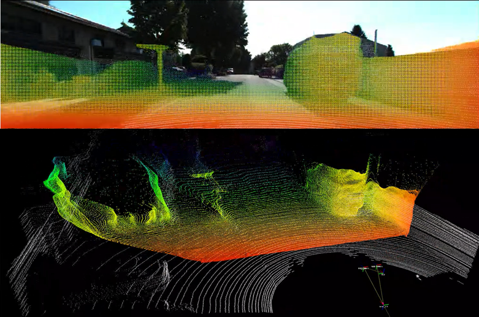

# FSNet

This repo aims to provide a flexible and reproducible **Full-Scale** Unsupervised Monocular Depth Prediction from well-calibrated/tracked image sequences. 

The repo share a similar design strategy with [visualDet3D], but we adopt a even more flexible design for data processing and config construction, allowing easy insertion of new tasks/models while not interfere with the existing ones.

We provide cookbooks and solutions for Full-Scale Unsupervised Depth Prediction in [KITTI], [KITTI360], [NuScenes], and [KITTI-360 Fisheye]. Links are directed to their corresponding cookbooks. We hope we could make training/testing/deploying/ROS demo easier.

Reference: this repo borrow codes and ideas from [visualDet3D], [monodepth2]. 



## Setup:

### Environment setup
```bash
pip3 install -r requirement.txt
```

or manually check dependencies.

### Docker Setup

```bash
cd docker
docker build ./ -t fsnet
```
The image will contain necessary packages for the repo. 

## Training / Testing

Please check the corresponding datasets: [KITTI], [KITTI360], [NuScenes], and [KITTI-360 Fisheye]. More will be available through contributions and further paper submission.

### Config and Path setup

Please modify the path and other parameters in **config/\*.py**. **config/\*_example** files are templates.

**Notice**:
*_examples are **NOT** utilized by the code and \*.py under /config is **ignored** by .gitignore.

The content of the selected config file will be recorded in tensorboard at the beginning of training.

**important paths to modify in config** :
1. cfg.path.{data}_path: Path to the data directory.
2. cfg.path.project_path: Path to the workdirs of the projects (will have temp_outputs, log, checkpoints)

### Multi-Dataset Training

We can use the [ConcatDataset](vision_base/data/datasets/dataset_utils.py) APIs to jointly train one depth prediction network using multiple datasets. The output of each dataset indexing methods should output dictionaries with same keys and same tensor shapes, but we could define different data-proprocessing pipelines for each dataset and align multiple datasets if needed. 

### Build Module Path

In the project, most of the modules are initialized by [builder](vision_base/utils/builder.py) and [find_object](vision_base/utils/utils.py). The builder will import and initialize the target object/function based on the full import path. Please check the example configs.

## Further Info and Bug Issues

1. Open issues on the repo if you meet troubles or find a bug or have some suggestions.
2. Email to yliuhb@connect.ust.hk


## Other Resources

- [RAM-LAB](https://www.ram-lab.com)
- [Collections of Papers and Readings](https://owen-liuyuxuan.github.io/papers_reading_sharing.github.io/);


[visualDet3D]:https://github.com/Owen-Liuyuxuan/visualDet3D
[KITTI]:docs/kitti.md
[KITTI360]:docs/kitti360.md
[NuScenes]:docs/nuscenes.md
[KITTI-360 Fisheye]:docs/fisheye.md
[monodepth2]:https://github.com/nianticlabs/monodepth2